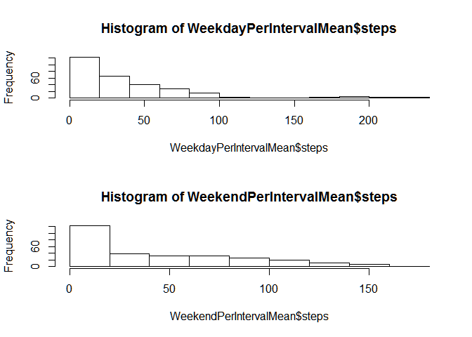

# Reproducible Research: Peer Assessment 1
Jim Callahan  
September 13, 2015  
This report analyzes the number of steps taken by an anonymous individual
user of a personal fitness armband device similar to the Nike "Fit" armband. 
The number of steps were measured over five minute intervals, 
24 hours a day during the months of October and November 2012.

The 2012 steps per five minute interval data is for the months of
October (30 days) and November (31 days) for a total of 61 days. 
In each hour there are 12 "five minute" intervals 
(60/5 = 12 intervals per hour). Thus, there are 288 five minute 
intervals in a 24 hour day (288 = 24 hours * 12 intervals per hour).
Thus with 288 measurements per day for 61 days (24 hour days) 
one would **expect 17,568 observations** (17,568 = 61 days * 288 per 24 hour day).


### Loading and preprocessing the data
The dataset is stored in a comma-separated-value (CSV) file in the main direcory of a GitHub repository. So, we can load the data with an R "read.csv()" function. In this case
we will use an R dataframe name "activity" the same as the input filename. Finally, the initial struture of the R dataframe is shown with the R str() function:

```r
#### Set directory to the local GitHub project of this assignment.
setwd("~\\GitHub\\RepData_PeerAssessment1")

activity <- read.csv("activity.csv", 
                     na.strings = "NA", stringsAsFactors = FALSE )

str(activity)
```

```
## 'data.frame':	17568 obs. of  3 variables:
##  $ steps   : int  NA NA NA NA NA NA NA NA NA NA ...
##  $ date    : chr  "2012-10-01" "2012-10-01" "2012-10-01" "2012-10-01" ...
##  $ interval: int  0 5 10 15 20 25 30 35 40 45 ...
```

**As expected**, for 61 days, **the "activity" data frame has 17,568 observations**.
The **"activity"** data frame has three variables: **"steps", "date"** and **"interval"**.
The initial values for the **"steps"** variable are missing.
The  **"date"** variable is a character string we will want to convert
that to an R date type using the R "as.Date()" function.
The **"interval"** variable is an integer that intially appears to be incremented
by 5 for each observation, this first impression will be modified on 
closer observation. 

So, let's convert **"date"** to an R date type and take a closer look 
at **"steps"** and **"interval"**. We want to know if all of the **"steps"** are missing?
or if not all are missing, how many are missing? and what percentage of the
dataset is that? For the **"interval"** variable, we want to know how often the pattern restarts
at zero (or does it increase all the way through the data set?).
We will print 289 observations of **"interval"**, one more than the 288 observations per day.

```r
activity$date <- as.Date(activity$date)
sum(is.na(activity$steps))       # How many missing values?
```

```
## [1] 2304
```

```r
mean(is.na(activity$steps))      # What percent missing values?
```

```
## [1] 0.1311475
```

```r
head(activity$interval, 289)      # What does a full daily cycle look like?
```

```
##   [1]    0    5   10   15   20   25   30   35   40   45   50   55  100  105
##  [15]  110  115  120  125  130  135  140  145  150  155  200  205  210  215
##  [29]  220  225  230  235  240  245  250  255  300  305  310  315  320  325
##  [43]  330  335  340  345  350  355  400  405  410  415  420  425  430  435
##  [57]  440  445  450  455  500  505  510  515  520  525  530  535  540  545
##  [71]  550  555  600  605  610  615  620  625  630  635  640  645  650  655
##  [85]  700  705  710  715  720  725  730  735  740  745  750  755  800  805
##  [99]  810  815  820  825  830  835  840  845  850  855  900  905  910  915
## [113]  920  925  930  935  940  945  950  955 1000 1005 1010 1015 1020 1025
## [127] 1030 1035 1040 1045 1050 1055 1100 1105 1110 1115 1120 1125 1130 1135
## [141] 1140 1145 1150 1155 1200 1205 1210 1215 1220 1225 1230 1235 1240 1245
## [155] 1250 1255 1300 1305 1310 1315 1320 1325 1330 1335 1340 1345 1350 1355
## [169] 1400 1405 1410 1415 1420 1425 1430 1435 1440 1445 1450 1455 1500 1505
## [183] 1510 1515 1520 1525 1530 1535 1540 1545 1550 1555 1600 1605 1610 1615
## [197] 1620 1625 1630 1635 1640 1645 1650 1655 1700 1705 1710 1715 1720 1725
## [211] 1730 1735 1740 1745 1750 1755 1800 1805 1810 1815 1820 1825 1830 1835
## [225] 1840 1845 1850 1855 1900 1905 1910 1915 1920 1925 1930 1935 1940 1945
## [239] 1950 1955 2000 2005 2010 2015 2020 2025 2030 2035 2040 2045 2050 2055
## [253] 2100 2105 2110 2115 2120 2125 2130 2135 2140 2145 2150 2155 2200 2205
## [267] 2210 2215 2220 2225 2230 2235 2240 2245 2250 2255 2300 2305 2310 2315
## [281] 2320 2325 2330 2335 2340 2345 2350 2355    0
```

Over 2,300 observations of the **"steps"** variable are missing, 
while this is a lot; it is still only 13.1% of the 17,568 observations. 
So, for our initial analysis, we can simply ignore the missing values, 
by removing them and only work with complete cases. Later, we can try
to guess (technically, "impute") the missing values in a process
called "imputation" and see whether that changes the analysis. Not shown,
but there are no missing values for **"date"** and **"interval"**.

The **"interval"** variable does not make sense as an integer.  
Although, the **"interval"** variable does reset to zero at observation 67,
as expected (recall there are 66 observations per 24 hour day); 
the 66th observation is 2,355 rather than the 1,435 one would expect
if one multiplied the intervals 0 (zero) through 287 by 5 (1,435 = 287*5). 
That is a big gap between 2,355 and 1,435 so something different is going on.  

If we examine the first dozen observations we see the **"interval"** variable jumps 
from 55 to 100. It is 100 when it should be 60. But, wait, if the "1" in "100" 
represents "one hour" and the "23" in "2355" represents "23 hours" then it is clear 
that the **"interval"** variable is actually hours and minutes with the leading zeros removed. 
That is, "100" should be understood as "01:00" and "2355" should be understood as "23:55" and so on.

We can fix the integer representation by using the **R "sprinf()"** function 
to restore the leading zeros to the time and store the result in a variable 
named **"HHMM"** which in turn, can be combined with the date to build a POSIX standard 
date time string in a variable named, **"datetime"**.

```r
# Convert the interval to HHMM by formating with leading zero
activity$HHMM <- sprintf("%04d",as.integer(activity$interval))
# Now we can combine date and time as a string
# and format the resulting string as a POSIX datetime string
datetimestring     <- paste(activity$date, activity$HHMM)
activity$datetime  <- strptime(datetimestring, 
                               "%Y-%m-%d %H%M", tz = "")
activity$dayofweek <- weekdays(activity$datetime, abbreviate=TRUE)
activity$daytype = "weekday"
activity$daytype[activity$dayofweek == "Sat" | activity$dayofweek == "Sun"] <- "weekend"
# Convert to factors
activity$dayofweek = factor(activity$dayofweek)
activity$daytype   = factor(activity$daytype)
```
With these changes, the **"activity"** data set is ready for the first stage
of our analysis where we simply ignore (remove) the missing values. 
But, for cosmetic reasons, we might want to reorder the **"activity"** data frame variables 
in a more logical order:

```r
activity <- subset( activity, select = c(datetime, date, dayofweek, daytype, HHMM, interval, steps))
str(activity)
```

```
## 'data.frame':	17568 obs. of  7 variables:
##  $ datetime : POSIXlt, format: "2012-10-01 00:00:00" "2012-10-01 00:05:00" ...
##  $ date     : Date, format: "2012-10-01" "2012-10-01" ...
##  $ dayofweek: Factor w/ 7 levels "Fri","Mon","Sat",..: 2 2 2 2 2 2 2 2 2 2 ...
##  $ daytype  : Factor w/ 2 levels "weekday","weekend": 1 1 1 1 1 1 1 1 1 1 ...
##  $ HHMM     : chr  "0000" "0005" "0010" "0015" ...
##  $ interval : int  0 5 10 15 20 25 30 35 40 45 ...
##  $ steps    : int  NA NA NA NA NA NA NA NA NA NA ...
```


### What is mean total number of steps taken per day?
If we sum the steps all of the intervals for a given date, we have a daily total.
This use of the **R aggregate()** function follows an example in Jared Lander's 
book *"R for Everyone"* page 121 where he uses the **"diamonds"** data frame 
which comes with the **ggplot2** package.

Once we have a daily total for each of the days; we can calcuate a value for
the average (mean) and median by removing the NAs, that would otherwise
cause an NA result.

```r
PerDay <- aggregate(steps ~ date, data=activity, sum)  
meanstepsperday <- round(mean(PerDay$steps, na.rm = TRUE), digits = 0)
meanstepsperday
```

```
## [1] 10766
```

```r
medianstepsperday <- median(PerDay$steps, na.rm = TRUE) 
medianstepsperday
```

```
## [1] 10765
```

The **average (mean) number of steps per day** is 
**10,766 **; 
and the **median number of steps per day** is close at 
**10,765**.  

### What is the average daily activity pattern?
These 10,000+ values seem plausible to me for an active person   
with a 10,000 step a day goal, which seems to be popular goal:

> "The origins of the 10,000-steps recommendation  
> aren't exactly scientific.  Pedometers sold in Japan  
> in the 1960s were marketed under the name "manpo-kei,"  
> which translates to "10,000 steps meter"   
> ...studies conducted since then suggest that people who 
> increased their walking to 10,000 steps daily  
> experience health benefits."  
> Rachael Rettner, *"The Truth About '10,000 Steps' a Day"* 
LiveScience.org, March 2014  
retrieved from **LiveScience.org** during September 2015  
http://www.livescience.com/43956-walking-10000-steps-healthy.html

 

While a central value (mean or median) near 10,000 seems plausible for   
an active person with a 10,000 steps per day goal; the extremes of   
near zero steps per day and a maximum over 20,000 steps per day may   
require further inquiry. For example, did the person spend a sick day  
in bed (with near zero steps)? and did the person participate in   
a 10,000 step walk in addition to their normal 10,000 steps  
(resulting in over 20,000 steps per day)?  


```r
# Calculate steps per five minute interval
# (in 24 hour cycle)
# PerIntervalSum     <- aggregate(steps ~ factor(HHMM), activity, sum)
PerIntervalMean    <- aggregate(steps ~ factor(HHMM), activity, mean)
PerIntervalMedian  <- aggregate(steps ~ factor(HHMM), activity, median)
ColumnNames <- c("HHMM", "steps")
# colnames(PerIntervalSum)    <- ColumnNames
colnames(PerIntervalMean)   <- ColumnNames
colnames(PerIntervalMedian) <- ColumnNames


PerIntervalMean$timeofday    <- strptime(PerIntervalMean$HHMM, "%H%M", tz = "")
PerIntervalMedian$timeofday  <- strptime(PerIntervalMedian$HHMM, "%H%M", tz = "")

Max5MinuteSteps <- PerIntervalMean[PerIntervalMean$steps == max(PerIntervalMean$steps), ]
# ColumnNames <- c("timeofday", "steps")
# colnames(Max5MinuteSteps) <- ColumnNames
Max5MinuteSteps
```

```
##     HHMM    steps           timeofday
## 104 0835 206.1698 2015-09-18 08:35:00
```

```r
plot(PerIntervalMean$timeofday, PerIntervalMean$steps, type = "l",
          main = paste("Average Steps Per Five Minute Interval", 
                       "\n Maximum = " , round(max(PerIntervalMean$steps), digits=0),
                       "\n Maximum occurs at: ", format(Max5MinuteSteps$timeofday, "%H:%M AM")
                        )
          )

abline(h = round(max(PerIntervalMean$steps), digits=0), col = "red") 
```

 

```r
# abline(v = Max5MinuteSteps$timeofday, col = "red") 
```


### Imputing missing values
As noted earlier, over 2,300 observations of the **"steps"** variable are missing, 
while this is a lot; it is still only 13.1% of the 17,568 observations. 

```r
sum(is.na(activity$steps))       # How many missing values?
```

```
## [1] 2304
```

```r
mean(is.na(activity$steps))      # What percent missing values?
```

```
## [1] 0.1311475
```

```r
head(activity$interval, 289)      # What does a full daily cycle look like?
```

```
##   [1]    0    5   10   15   20   25   30   35   40   45   50   55  100  105
##  [15]  110  115  120  125  130  135  140  145  150  155  200  205  210  215
##  [29]  220  225  230  235  240  245  250  255  300  305  310  315  320  325
##  [43]  330  335  340  345  350  355  400  405  410  415  420  425  430  435
##  [57]  440  445  450  455  500  505  510  515  520  525  530  535  540  545
##  [71]  550  555  600  605  610  615  620  625  630  635  640  645  650  655
##  [85]  700  705  710  715  720  725  730  735  740  745  750  755  800  805
##  [99]  810  815  820  825  830  835  840  845  850  855  900  905  910  915
## [113]  920  925  930  935  940  945  950  955 1000 1005 1010 1015 1020 1025
## [127] 1030 1035 1040 1045 1050 1055 1100 1105 1110 1115 1120 1125 1130 1135
## [141] 1140 1145 1150 1155 1200 1205 1210 1215 1220 1225 1230 1235 1240 1245
## [155] 1250 1255 1300 1305 1310 1315 1320 1325 1330 1335 1340 1345 1350 1355
## [169] 1400 1405 1410 1415 1420 1425 1430 1435 1440 1445 1450 1455 1500 1505
## [183] 1510 1515 1520 1525 1530 1535 1540 1545 1550 1555 1600 1605 1610 1615
## [197] 1620 1625 1630 1635 1640 1645 1650 1655 1700 1705 1710 1715 1720 1725
## [211] 1730 1735 1740 1745 1750 1755 1800 1805 1810 1815 1820 1825 1830 1835
## [225] 1840 1845 1850 1855 1900 1905 1910 1915 1920 1925 1930 1935 1940 1945
## [239] 1950 1955 2000 2005 2010 2015 2020 2025 2030 2035 2040 2045 2050 2055
## [253] 2100 2105 2110 2115 2120 2125 2130 2135 2140 2145 2150 2155 2200 2205
## [267] 2210 2215 2220 2225 2230 2235 2240 2245 2250 2255 2300 2305 2310 2315
## [281] 2320 2325 2330 2335 2340 2345 2350 2355    0
```

There seems to be a regular pattern for time of day, but we still have to decided
whether we should impute with 5 minute interval **averages** or **medians**.

We have already computed a graph of the **five minute means (averages)**, for comparison 
here is a graph of **median steps per five minutes**, it peaks at 60 steps
and often takes on a zero value.


```r
plot(PerIntervalMedian$timeofday, PerIntervalMedian$steps, type = "l",
          main = paste("Median Steps Per Five Minute Interval", 
                       "\n Maximum = " , round(max(PerIntervalMedian$steps), digits=0)
                       )

    )
```

 

So, let's use the **"steps"** variable in the **"PerIntervalMedian"** data frame 
to create a variable we can use to impute (fill-in) the missing values of 
the **"steps"** variable in the **"activity"** data frame. We need to expand 
the **"PerIntervalMedian"** version of **"steps"** which is just one day 
to all 61 days (17,568 observations). We can do this in **R** by repeating 
the variable 61 times using the **R rep()** function:


```r
activity$fill <- rep(PerIntervalMedian$steps, 61)
str(activity$fill)
```

```
##  int [1:17568] 0 0 0 0 0 0 0 0 0 0 ...
```

Now we can define two variables **maskNA** and **maskValue**.
These zero-one variables are like dummy variables in econometrics or
bit-masks in computer science.


```r
maskNA    <-  is.na(activity$steps)   # 1 where steps is missing; 0 everywhere else
maskValue <- ~is.na(activity$steps)   # 1 where steps has a value; 0 eveywhere else
```

In order to fill in the missing values; we want to multiply **"steps"** by **"maskValue"**
and multiply **"fill"** by **"maskNA"** and then add the resulting two variables
together. What happens is **"maskValue"** preserves the values in **"steps"** while
zeroing out the NAs; while "fill" times maskNA preserves the values where there are NAs
and converts all of the other values to zero.

Unfortunately, just multiplyting **"steps"**" by maskValue won't replace the NAs with zeros
because NA times any value is still NA; so we have to use another method to replace
the NAs in **"steps"** with zeros.


```r
# What we would have liked to have done:
# activity$stepsNoMissing <- (activity$steps*maskValue) + (activity$fill*maskNA)
#
#Instead
# Stackoverflow
# http://stackoverflow.com/questions/10139284/set-na-to-0-in-r
stepsNA2Zero <- activity$steps
stepsNA2Zero[is.na(stepsNA2Zero)] <- 0


# Now we can add the values
activity$stepsNoNA <- stepsNA2Zero + (activity$fill*maskNA)
sum(is.na(activity$stepsNoNA))       # How many missing values in "NoNA" version?
```

```
## [1] 0
```

```r
mean(is.na(activity$stepsNoNA))      # What percent missing values in "NoNA" version?
```

```
## [1] 0
```


Is the average being skewed by one extreme value at 8:35 AM?


```r
PeakIntervalSlice <- activity[activity$HHMM == "0835", ]
# PeakIntervalSlice   # display of data omitted for space reasons.
hist(PeakIntervalSlice$steps,
    main = ("Histogram of raw steps @ 8:35 AM")
)
```

 

The histogram shows the problem; the distribution of raw (not summarized) steps 
at 8:35 AM is bi-modal with the peaks at extreme values of zero and 
700-800 steps per hour; neither a mean, nor a median is likely to summarize this well!

Visual inspection of the data shows that zeros are not limited to weekends
and the 700+ values occur during weekdays and are not the result of weekend
special events or treadmill time.

My guess is that the five minute intervals are too narrow to capture the commute
of this individual. The peak walking of the morning commute may occur during
this window or may occur a little later or earlier depending on whether the commuter
is running early or late. The five minute interval being to narrow is analogous
to the bin ons a histogram being to narrow -- the histogram is noisey and the overall
shape is lost.


### Are there differences in activity patterns between weekdays and weekends?


```r
DayTypePerIntervalMean    <- aggregate(steps ~ factor(HHMM)+daytype, activity, mean)
DayTypePerIntervalMean
```

```
##     factor(HHMM) daytype       steps
## 1           0000 weekday   2.3333333
## 2           0005 weekday   0.4615385
## 3           0010 weekday   0.1794872
## 4           0015 weekday   0.2051282
## 5           0020 weekday   0.1025641
## 6           0025 weekday   1.5128205
## 7           0030 weekday   0.7179487
## 8           0035 weekday   1.1794872
## 9           0040 weekday   0.0000000
## 10          0045 weekday   1.8461538
## 11          0050 weekday   0.4102564
## 12          0055 weekday   0.0000000
## 13          0100 weekday   0.4358974
## 14          0105 weekday   0.0000000
## 15          0110 weekday   0.2051282
## 16          0115 weekday   0.4615385
## 17          0120 weekday   0.0000000
## 18          0125 weekday   1.5128205
## 19          0130 weekday   2.2820513
## 20          0135 weekday   0.0000000
## 21          0140 weekday   0.2307692
## 22          0145 weekday   0.2307692
## 23          0150 weekday   0.3589744
## 24          0155 weekday   0.0000000
## 25          0200 weekday   0.0000000
## 26          0205 weekday   0.0000000
## 27          0210 weekday   1.4358974
## 28          0215 weekday   0.0000000
## 29          0220 weekday   0.0000000
## 30          0225 weekday   0.1794872
## 31          0230 weekday   0.0000000
## 32          0235 weekday   0.3076923
## 33          0240 weekday   0.0000000
## 34          0245 weekday   0.0000000
## 35          0250 weekday   2.1025641
## 36          0255 weekday   1.2820513
## 37          0300 weekday   0.0000000
## 38          0305 weekday   0.0000000
## 39          0310 weekday   0.0000000
## 40          0315 weekday   0.0000000
## 41          0320 weekday   0.0000000
## 42          0325 weekday   0.8461538
## 43          0330 weekday   1.1794872
## 44          0335 weekday   0.5128205
## 45          0340 weekday   0.4102564
## 46          0345 weekday   0.1025641
## 47          0350 weekday   0.0000000
## 48          0355 weekday   0.0000000
## 49          0400 weekday   0.1282051
## 50          0405 weekday   1.2820513
## 51          0410 weekday   2.1794872
## 52          0415 weekday   0.0000000
## 53          0420 weekday   0.4615385
## 54          0425 weekday   0.0000000
## 55          0430 weekday   3.2564103
## 56          0435 weekday   0.1538462
## 57          0440 weekday   3.8205128
## 58          0445 weekday   0.8974359
## 59          0450 weekday   2.2307692
## 60          0455 weekday   0.6666667
## 61          0500 weekday   0.0000000
## 62          0505 weekday   2.1282051
## 63          0510 weekday   4.0769231
## 64          0515 weekday   2.1794872
## 65          0520 weekday   4.3589744
## 66          0525 weekday   2.6666667
## 67          0530 weekday   2.8461538
## 68          0535 weekday   8.2307692
## 69          0540 weekday  21.0769231
## 70          0545 weekday  24.4615385
## 71          0550 weekday  52.0256410
## 72          0555 weekday  58.0769231
## 73          0600 weekday  42.7948718
## 74          0605 weekday  66.9487179
## 75          0610 weekday  72.5897436
## 76          0615 weekday  79.2564103
## 77          0620 weekday  66.0769231
## 78          0625 weekday  62.0256410
## 79          0630 weekday  68.6410256
## 80          0635 weekday  49.3076923
## 81          0640 weekday  57.4615385
## 82          0645 weekday  56.5128205
## 83          0650 weekday  48.5384615
## 84          0655 weekday  62.1794872
## 85          0700 weekday  51.6410256
## 86          0705 weekday  51.8205128
## 87          0710 weekday  63.7948718
## 88          0715 weekday  71.6153846
## 89          0720 weekday  65.1282051
## 90          0725 weekday  60.3589744
## 91          0730 weekday  67.8461538
## 92          0735 weekday  55.8974359
## 93          0740 weekday  64.3333333
## 94          0745 weekday  85.5128205
## 95          0750 weekday  69.2564103
## 96          0755 weekday  68.1794872
## 97          0800 weekday  84.1538462
## 98          0805 weekday  72.5384615
## 99          0810 weekday 146.2564103
## 100         0815 weekday 185.7435897
## 101         0820 weekday 205.1025641
## 102         0825 weekday 187.9487179
## 103         0830 weekday 202.2051282
## 104         0835 weekday 234.1025641
## 105         0840 weekday 222.4358974
## 106         0845 weekday 186.5897436
## 107         0850 weekday 192.4358974
## 108         0855 weekday 178.6410256
## 109         0900 weekday 171.3846154
## 110         0905 weekday 126.0512821
## 111         0910 weekday  91.6153846
## 112         0915 weekday  84.1025641
## 113         0920 weekday 103.5128205
## 114         0925 weekday  91.9230769
## 115         0930 weekday  57.3333333
## 116         0935 weekday  34.4102564
## 117         0940 weekday  27.8717949
## 118         0945 weekday  41.1794872
## 119         0950 weekday  39.7692308
## 120         0955 weekday  17.1025641
## 121         1000 weekday  37.4615385
## 122         1005 weekday  16.8717949
## 123         1010 weekday  38.5641026
## 124         1015 weekday  47.0769231
## 125         1020 weekday  29.0256410
## 126         1025 weekday  32.7435897
## 127         1030 weekday  31.4102564
## 128         1035 weekday  22.2307692
## 129         1040 weekday  21.7948718
## 130         1045 weekday  25.5384615
## 131         1050 weekday  21.5641026
## 132         1055 weekday  21.9230769
## 133         1100 weekday  20.2051282
## 134         1105 weekday  24.3846154
## 135         1110 weekday  10.2051282
## 136         1115 weekday  14.8461538
## 137         1120 weekday  23.5384615
## 138         1125 weekday  23.3076923
## 139         1130 weekday  32.6666667
## 140         1135 weekday  50.2307692
## 141         1140 weekday  44.9487179
## 142         1145 weekday  48.4358974
## 143         1150 weekday  50.7435897
## 144         1155 weekday  55.6666667
## 145         1200 weekday  54.4615385
## 146         1205 weekday  70.5641026
## 147         1210 weekday  81.9230769
## 148         1215 weekday  72.5897436
## 149         1220 weekday  46.4615385
## 150         1225 weekday  46.3076923
## 151         1230 weekday  63.8205128
## 152         1235 weekday  30.4871795
## 153         1240 weekday  21.2820513
## 154         1245 weekday  28.0256410
## 155         1250 weekday  30.8974359
## 156         1255 weekday  54.9487179
## 157         1300 weekday  21.8717949
## 158         1305 weekday  23.5641026
## 159         1310 weekday  21.6923077
## 160         1315 weekday  11.7435897
## 161         1320 weekday  34.0000000
## 162         1325 weekday  43.0769231
## 163         1330 weekday  30.0769231
## 164         1335 weekday  23.0256410
## 165         1340 weekday  22.9743590
## 166         1345 weekday  38.1282051
## 167         1350 weekday  22.2307692
## 168         1355 weekday  32.5641026
## 169         1400 weekday  45.5641026
## 170         1405 weekday  37.6410256
## 171         1410 weekday  30.3589744
## 172         1415 weekday  44.4871795
## 173         1420 weekday  26.2564103
## 174         1425 weekday  29.7179487
## 175         1430 weekday  29.8974359
## 176         1435 weekday  12.5128205
## 177         1440 weekday  10.6923077
## 178         1445 weekday  21.3589744
## 179         1450 weekday  41.5897436
## 180         1455 weekday  37.4358974
## 181         1500 weekday  31.0000000
## 182         1505 weekday  34.8974359
## 183         1510 weekday  29.1025641
## 184         1515 weekday  30.8461538
## 185         1520 weekday  38.9230769
## 186         1525 weekday  35.7435897
## 187         1530 weekday  41.2051282
## 188         1535 weekday  48.7179487
## 189         1540 weekday  91.7435897
## 190         1545 weekday  95.4358974
## 191         1550 weekday  92.6923077
## 192         1555 weekday  68.2051282
## 193         1600 weekday  44.5384615
## 194         1605 weekday  42.2820513
## 195         1610 weekday  53.8461538
## 196         1615 weekday  31.9743590
## 197         1620 weekday  22.1794872
## 198         1625 weekday  24.8717949
## 199         1630 weekday  19.2307692
## 200         1635 weekday  19.2564103
## 201         1640 weekday  22.9743590
## 202         1645 weekday  29.9230769
## 203         1650 weekday  24.7692308
## 204         1655 weekday  30.6923077
## 205         1700 weekday  20.0256410
## 206         1705 weekday  43.2051282
## 207         1710 weekday  31.6410256
## 208         1715 weekday  46.0512821
## 209         1720 weekday  58.1794872
## 210         1725 weekday  71.3589744
## 211         1730 weekday  54.1794872
## 212         1735 weekday  66.7692308
## 213         1740 weekday  84.0769231
## 214         1745 weekday  59.7692308
## 215         1750 weekday  34.4615385
## 216         1755 weekday  37.6153846
## 217         1800 weekday  24.4871795
## 218         1805 weekday  44.8717949
## 219         1810 weekday  66.0769231
## 220         1815 weekday  82.2307692
## 221         1820 weekday  61.7179487
## 222         1825 weekday  74.3333333
## 223         1830 weekday  79.4615385
## 224         1835 weekday  82.6153846
## 225         1840 weekday  92.6923077
## 226         1845 weekday 117.9230769
## 227         1850 weekday 103.5641026
## 228         1855 weekday  91.3589744
## 229         1900 weekday  87.9743590
## 230         1905 weekday  77.1282051
## 231         1910 weekday  63.0512821
## 232         1915 weekday  54.5384615
## 233         1920 weekday  38.1282051
## 234         1925 weekday  20.5384615
## 235         1930 weekday  29.3589744
## 236         1935 weekday  46.8974359
## 237         1940 weekday  30.0256410
## 238         1945 weekday  17.5128205
## 239         1950 weekday  44.0512821
## 240         1955 weekday  26.3333333
## 241         2000 weekday  12.4358974
## 242         2005 weekday   3.4871795
## 243         2010 weekday   4.8974359
## 244         2015 weekday  11.1538462
## 245         2020 weekday   5.9230769
## 246         2025 weekday   3.3333333
## 247         2030 weekday   7.0769231
## 248         2035 weekday   4.9743590
## 249         2040 weekday   7.3333333
## 250         2045 weekday  11.8461538
## 251         2050 weekday  25.0000000
## 252         2055 weekday  16.8717949
## 253         2100 weekday  10.6666667
## 254         2105 weekday  19.1538462
## 255         2110 weekday  29.2820513
## 256         2115 weekday  18.8974359
## 257         2120 weekday  14.5641026
## 258         2125 weekday   8.0512821
## 259         2130 weekday  12.5128205
## 260         2135 weekday  16.5384615
## 261         2140 weekday   6.8974359
## 262         2145 weekday   7.5641026
## 263         2150 weekday   8.2820513
## 264         2155 weekday   3.5641026
## 265         2200 weekday   1.5384615
## 266         2205 weekday   4.5384615
## 267         2210 weekday   6.5384615
## 268         2215 weekday  11.5641026
## 269         2220 weekday   9.6153846
## 270         2225 weekday  11.1794872
## 271         2230 weekday  13.2564103
## 272         2235 weekday   3.0000000
## 273         2240 weekday   0.0000000
## 274         2245 weekday   0.1538462
## 275         2250 weekday   1.9487179
## 276         2255 weekday   1.6153846
## 277         2300 weekday   3.5897436
## 278         2305 weekday   3.8717949
## 279         2310 weekday   0.0000000
## 280         2315 weekday   1.1282051
## 281         2320 weekday   1.3076923
## 282         2325 weekday   1.9230769
## 283         2330 weekday   3.1025641
## 284         2335 weekday   1.8717949
## 285         2340 weekday   2.0769231
## 286         2345 weekday   0.2051282
## 287         2350 weekday   0.3076923
## 288         2355 weekday   1.4615385
## 289         0000 weekend   0.0000000
## 290         0005 weekend   0.0000000
## 291         0010 weekend   0.0000000
## 292         0015 weekend   0.0000000
## 293         0020 weekend   0.0000000
## 294         0025 weekend   3.7142857
## 295         0030 weekend   0.0000000
## 296         0035 weekend   0.0000000
## 297         0040 weekend   0.0000000
## 298         0045 weekend   0.4285714
## 299         0050 weekend   0.0000000
## 300         0055 weekend   0.5000000
## 301         0100 weekend   0.0000000
## 302         0105 weekend   2.5714286
## 303         0110 weekend   0.0000000
## 304         0115 weekend   0.0000000
## 305         0120 weekend   0.0000000
## 306         0125 weekend   0.0000000
## 307         0130 weekend   0.5714286
## 308         0135 weekend   0.6428571
## 309         0140 weekend   0.0000000
## 310         0145 weekend   0.7857143
## 311         0150 weekend   0.0000000
## 312         0155 weekend   0.0000000
## 313         0200 weekend   0.0000000
## 314         0205 weekend   0.0000000
## 315         0210 weekend   0.2857143
## 316         0215 weekend   0.0000000
## 317         0220 weekend   0.0000000
## 318         0225 weekend   0.0000000
## 319         0230 weekend   0.0000000
## 320         0235 weekend   0.0000000
## 321         0240 weekend   0.0000000
## 322         0245 weekend   0.0000000
## 323         0250 weekend   0.0000000
## 324         0255 weekend   0.0000000
## 325         0300 weekend   0.0000000
## 326         0305 weekend   0.0000000
## 327         0310 weekend   0.0000000
## 328         0315 weekend   0.0000000
## 329         0320 weekend   0.7857143
## 330         0325 weekend   0.0000000
## 331         0330 weekend   2.8571429
## 332         0335 weekend   0.7857143
## 333         0340 weekend   0.7142857
## 334         0345 weekend   0.0000000
## 335         0350 weekend   0.0000000
## 336         0355 weekend   0.0000000
## 337         0400 weekend   4.1428571
## 338         0405 weekend   0.0000000
## 339         0410 weekend   3.6428571
## 340         0415 weekend   0.0000000
## 341         0420 weekend   0.0000000
## 342         0425 weekend   1.3571429
## 343         0430 weekend   6.5000000
## 344         0435 weekend   2.0714286
## 345         0440 weekend   2.5714286
## 346         0445 weekend   0.6428571
## 347         0450 weekend   5.5714286
## 348         0455 weekend   2.3571429
## 349         0500 weekend   0.0000000
## 350         0505 weekend   0.0000000
## 351         0510 weekend   0.0000000
## 352         0515 weekend   2.4285714
## 353         0520 weekend   0.4285714
## 354         0525 weekend   3.7857143
## 355         0530 weekend   0.0000000
## 356         0535 weekend   0.0000000
## 357         0540 weekend   1.9285714
## 358         0545 weekend   1.2857143
## 359         0550 weekend   4.4285714
## 360         0555 weekend   6.6428571
## 361         0600 weekend   0.0000000
## 362         0605 weekend   0.0000000
## 363         0610 weekend   1.3571429
## 364         0615 weekend  19.4285714
## 365         0620 weekend   5.0714286
## 366         0625 weekend   5.4285714
## 367         0630 weekend   6.2142857
## 368         0635 weekend  11.5714286
## 369         0640 weekend   6.5714286
## 370         0645 weekend   9.7857143
## 371         0650 weekend   6.2142857
## 372         0655 weekend  12.4285714
## 373         0700 weekend  22.0000000
## 374         0705 weekend  23.6428571
## 375         0710 weekend  13.5000000
## 376         0715 weekend   6.8571429
## 377         0720 weekend   7.5714286
## 378         0725 weekend  24.8571429
## 379         0730 weekend  21.7857143
## 380         0735 weekend  12.0714286
## 381         0740 weekend  18.6428571
## 382         0745 weekend  25.0714286
## 383         0750 weekend  26.0714286
## 384         0755 weekend  22.6428571
## 385         0800 weekend  43.3571429
## 386         0805 weekend  56.1428571
## 387         0810 weekend  82.5714286
## 388         0815 weekend  78.9285714
## 389         0820 weekend  76.5714286
## 390         0825 weekend  64.7142857
## 391         0830 weekend 107.9285714
## 392         0835 weekend 128.3571429
## 393         0840 weekend 122.0714286
## 394         0845 weekend 160.0000000
## 395         0850 weekend 158.2142857
## 396         0855 weekend 134.6428571
## 397         0900 weekend  65.6428571
## 398         0905 weekend 118.4285714
## 399         0910 weekend 157.8571429
## 400         0915 weekend 175.0000000
## 401         0920 weekend 104.2857143
## 402         0925 weekend 107.2142857
## 403         0930 weekend  90.9285714
## 404         0935 weekend  75.3571429
## 405         0940 weekend  16.2142857
## 406         0945 weekend  32.0000000
## 407         0950 weekend  21.6428571
## 408         0955 weekend  32.0714286
## 409         1000 weekend  49.2142857
## 410         1005 weekend  55.1428571
## 411         1010 weekend  53.1428571
## 412         1015 weekend  68.2142857
## 413         1020 weekend  66.5000000
## 414         1025 weekend 101.0714286
## 415         1030 weekend  80.1428571
## 416         1035 weekend  79.7142857
## 417         1040 weekend  70.6428571
## 418         1045 weekend  36.1428571
## 419         1050 weekend  34.9285714
## 420         1055 weekend  59.8571429
## 421         1100 weekend  62.4285714
## 422         1105 weekend  44.4285714
## 423         1110 weekend  52.2857143
## 424         1115 weekend  55.3571429
## 425         1120 weekend  41.8571429
## 426         1125 weekend  35.2857143
## 427         1130 weekend  35.5714286
## 428         1135 weekend  49.2857143
## 429         1140 weekend  33.9285714
## 430         1145 weekend  33.9285714
## 431         1150 weekend  32.9285714
## 432         1155 weekend  69.0000000
## 433         1200 weekend  90.0714286
## 434         1205 weekend 135.4285714
## 435         1210 weekend 130.8571429
## 436         1215 weekend 149.0000000
## 437         1220 weekend 110.5714286
## 438         1225 weekend  60.9285714
## 439         1230 weekend  28.4285714
## 440         1235 weekend  37.7857143
## 441         1240 weekend  41.1428571
## 442         1245 weekend  64.7857143
## 443         1250 weekend  84.5000000
## 444         1255 weekend 101.6428571
## 445         1300 weekend  99.3571429
## 446         1305 weekend  85.3571429
## 447         1310 weekend 103.3571429
## 448         1315 weekend 122.4285714
## 449         1320 weekend  80.3571429
## 450         1325 weekend  93.6428571
## 451         1330 weekend  78.0714286
## 452         1335 weekend  31.0000000
## 453         1340 weekend  87.2857143
## 454         1345 weekend  96.5000000
## 455         1350 weekend 117.2142857
## 456         1355 weekend 139.5000000
## 457         1400 weekend  84.1428571
## 458         1405 weekend  91.8571429
## 459         1410 weekend  80.4285714
## 460         1415 weekend  60.4285714
## 461         1420 weekend  61.1428571
## 462         1425 weekend  59.3571429
## 463         1430 weekend  75.1428571
## 464         1435 weekend  69.2857143
## 465         1440 weekend  35.0000000
## 466         1445 weekend  39.2142857
## 467         1450 weekend  49.2857143
## 468         1455 weekend  61.4285714
## 469         1500 weekend  27.2857143
## 470         1505 weekend  39.3571429
## 471         1510 weekend  53.2857143
## 472         1515 weekend  61.1428571
## 473         1520 weekend  65.5714286
## 474         1525 weekend  81.2142857
## 475         1530 weekend  67.4285714
## 476         1535 weekend 111.5714286
## 477         1540 weekend  58.2857143
## 478         1545 weekend 107.6428571
## 479         1550 weekend 128.3571429
## 480         1555 weekend 127.8571429
## 481         1600 weekend 111.1428571
## 482         1605 weekend 125.0000000
## 483         1610 weekend 132.2142857
## 484         1615 weekend 150.0714286
## 485         1620 weekend 153.6428571
## 486         1625 weekend 157.0000000
## 487         1630 weekend 112.5000000
## 488         1635 weekend  92.3571429
## 489         1640 weekend 105.0714286
## 490         1645 weekend  88.7142857
## 491         1650 weekend 105.9285714
## 492         1655 weekend  79.8571429
## 493         1700 weekend 120.7142857
## 494         1705 weekend  92.7857143
## 495         1710 weekend 103.8571429
## 496         1715 weekend 103.5000000
## 497         1720 weekend 113.2142857
## 498         1725 weekend 100.0714286
## 499         1730 weekend 110.0714286
## 500         1735 weekend  39.8571429
## 501         1740 weekend  50.0714286
## 502         1745 weekend  47.4285714
## 503         1750 weekend  35.6428571
## 504         1755 weekend  37.0000000
## 505         1800 weekend  85.7857143
## 506         1805 weekend  94.6428571
## 507         1810 weekend  98.7142857
## 508         1815 weekend  93.9285714
## 509         1820 weekend  52.4285714
## 510         1825 weekend  49.5000000
## 511         1830 weekend  72.7857143
## 512         1835 weekend  50.9285714
## 513         1840 weekend  64.8571429
## 514         1845 weekend  48.0000000
## 515         1850 weekend  39.2857143
## 516         1855 weekend  69.5714286
## 517         1900 weekend  76.2142857
## 518         1905 weekend  79.7857143
## 519         1910 weekend  44.0714286
## 520         1915 weekend  50.0714286
## 521         1920 weekend  31.2857143
## 522         1925 weekend  21.2142857
## 523         1930 weekend  21.9285714
## 524         1935 weekend  20.8571429
## 525         1940 weekend  30.7142857
## 526         1945 weekend  47.9285714
## 527         1950 weekend  50.1428571
## 528         1955 weekend  53.5714286
## 529         2000 weekend  39.6428571
## 530         2005 weekend  62.2857143
## 531         2010 weekend  59.5714286
## 532         2015 weekend  95.1428571
## 533         2020 weekend  85.0000000
## 534         2025 weekend  70.8571429
## 535         2030 weekend  83.6428571
## 536         2035 weekend  66.9285714
## 537         2040 weekend  53.5714286
## 538         2045 weekend  47.7142857
## 539         2050 weekend  52.6428571
## 540         2055 weekend  29.2857143
## 541         2100 weekend  30.6428571
## 542         2105 weekend  11.8571429
## 543         2110 weekend   7.2142857
## 544         2115 weekend  20.2142857
## 545         2120 weekend   6.5714286
## 546         2125 weekend   7.9285714
## 547         2130 weekend  20.6428571
## 548         2135 weekend  15.6428571
## 549         2140 weekend  13.6428571
## 550         2145 weekend   8.4285714
## 551         2150 weekend   7.7142857
## 552         2155 weekend   0.0000000
## 553         2200 weekend   1.2142857
## 554         2205 weekend   1.2857143
## 555         2210 weekend   0.0000000
## 556         2215 weekend   0.0000000
## 557         2220 weekend   0.0000000
## 558         2225 weekend   1.7857143
## 559         2230 weekend   0.0000000
## 560         2235 weekend   0.0000000
## 561         2240 weekend   1.2142857
## 562         2245 weekend   0.0000000
## 563         2250 weekend   0.6428571
## 564         2255 weekend  12.9285714
## 565         2300 weekend   2.5000000
## 566         2305 weekend   0.0000000
## 567         2310 weekend   0.0000000
## 568         2315 weekend   0.0000000
## 569         2320 weekend   0.0000000
## 570         2325 weekend   0.6428571
## 571         2330 weekend   1.2142857
## 572         2335 weekend  12.5714286
## 573         2340 weekend   6.7142857
## 574         2345 weekend   1.8571429
## 575         2350 weekend   0.0000000
## 576         2355 weekend   0.0000000
```

```r
WeekdayPerIntervalMean   <- DayTypePerIntervalMean[DayTypePerIntervalMean$daytype == "weekday", ]
WeekendPerIntervalMean   <- DayTypePerIntervalMean[DayTypePerIntervalMean$daytype == "weekend", ]

par(mfrow = c(2, 1) )
hist(WeekdayPerIntervalMean$steps)
hist(WeekendPerIntervalMean$steps)
```

 


