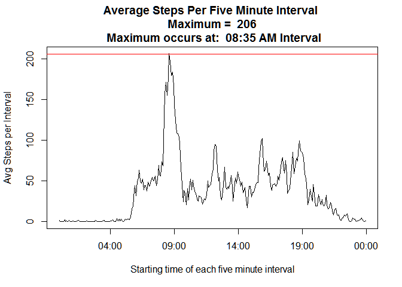

# Reproducible Research: Peer Assessment 1
Jim Callahan  
September 13, 2015  
This report analyzes the number of steps taken by an anonymous individual
user of a personal fitness armband device similar to the Nike "Fit" armband. 
The number of steps were measured over five minute intervals, 
24 hours a day during the months of October and November 2012.

The 2012 steps per five minute interval data is for the months of
October (30 days) and November (31 days) for a total of 61 days. 
In each hour there are 12 "five minute" intervals 
(60/5 = 12 intervals per hour). Thus, there are 288 five minute 
intervals in a 24 hour day (288 = 24 hours * 12 intervals per hour).
Thus with 288 measurements per day for 61 days (24 hour days) 
one would **expect 17,568 observations** (17,568 = 61 days * 288 per 24 hour day).


### Loading and preprocessing the data
The dataset is stored in a comma-separated-value (CSV) file in the main direcory of a GitHub repository. So, we can load the data with an R "read.csv()" function. In this case
we will use an R dataframe name "activity" the same as the input filename. Finally, the initial struture of the R dataframe is shown with the R str() function:

```r
#### Set directory to the local GitHub project of this assignment.
setwd("~\\GitHub\\RepData_PeerAssessment1")

activity <- read.csv("activity.csv", 
                     na.strings = "NA", stringsAsFactors = FALSE )

str(activity)
```

```
## 'data.frame':	17568 obs. of  3 variables:
##  $ steps   : int  NA NA NA NA NA NA NA NA NA NA ...
##  $ date    : chr  "2012-10-01" "2012-10-01" "2012-10-01" "2012-10-01" ...
##  $ interval: int  0 5 10 15 20 25 30 35 40 45 ...
```

**As expected**, for 61 days, **the "activity" data frame has 17,568 observations**.
The **"activity"** data frame has three variables: **"steps", "date"** and **"interval"**.
The initial values for the **"steps"** variable are missing.
The  **"date"** variable is a character string we will want to convert
that to an R date type using the R "as.Date()" function.
The **"interval"** variable is an integer that intially appears to be incremented
by 5 for each observation, this first impression will be modified on 
closer observation. 

So, let's convert **"date"** to an R date type and take a closer look 
at **"steps"** and **"interval"**. We want to know if all of the **"steps"** are missing?
or if not all are missing, how many are missing? and what percentage of the
dataset is that? For the **"interval"** variable, we want to know how often the pattern restarts
at zero (or does it increase all the way through the data set?).
We will print 289 observations of **"interval"**, one more than the 288 observations per day.

```r
activity$date <- as.Date(activity$date)
sum(is.na(activity$steps))       # How many missing values?
```

```
## [1] 2304
```

```r
mean(is.na(activity$steps))      # What percent missing values?
```

```
## [1] 0.1311475
```

```r
head(activity$interval, 289)      # What does a full daily cycle look like?
```

```
##   [1]    0    5   10   15   20   25   30   35   40   45   50   55  100  105
##  [15]  110  115  120  125  130  135  140  145  150  155  200  205  210  215
##  [29]  220  225  230  235  240  245  250  255  300  305  310  315  320  325
##  [43]  330  335  340  345  350  355  400  405  410  415  420  425  430  435
##  [57]  440  445  450  455  500  505  510  515  520  525  530  535  540  545
##  [71]  550  555  600  605  610  615  620  625  630  635  640  645  650  655
##  [85]  700  705  710  715  720  725  730  735  740  745  750  755  800  805
##  [99]  810  815  820  825  830  835  840  845  850  855  900  905  910  915
## [113]  920  925  930  935  940  945  950  955 1000 1005 1010 1015 1020 1025
## [127] 1030 1035 1040 1045 1050 1055 1100 1105 1110 1115 1120 1125 1130 1135
## [141] 1140 1145 1150 1155 1200 1205 1210 1215 1220 1225 1230 1235 1240 1245
## [155] 1250 1255 1300 1305 1310 1315 1320 1325 1330 1335 1340 1345 1350 1355
## [169] 1400 1405 1410 1415 1420 1425 1430 1435 1440 1445 1450 1455 1500 1505
## [183] 1510 1515 1520 1525 1530 1535 1540 1545 1550 1555 1600 1605 1610 1615
## [197] 1620 1625 1630 1635 1640 1645 1650 1655 1700 1705 1710 1715 1720 1725
## [211] 1730 1735 1740 1745 1750 1755 1800 1805 1810 1815 1820 1825 1830 1835
## [225] 1840 1845 1850 1855 1900 1905 1910 1915 1920 1925 1930 1935 1940 1945
## [239] 1950 1955 2000 2005 2010 2015 2020 2025 2030 2035 2040 2045 2050 2055
## [253] 2100 2105 2110 2115 2120 2125 2130 2135 2140 2145 2150 2155 2200 2205
## [267] 2210 2215 2220 2225 2230 2235 2240 2245 2250 2255 2300 2305 2310 2315
## [281] 2320 2325 2330 2335 2340 2345 2350 2355    0
```

Over 2,300 observations of the **"steps"** variable are missing, 
while this is a lot; it is still only 13.1% of the 17,568 observations. 
So, for our initial analysis, we can simply ignore the missing values, 
by removing them and only work with complete cases. Later, we can try
to guess (technically, "impute") the missing values in a process
called "imputation" and see whether that changes the analysis. Not shown,
but there are no missing values for **"date"** and **"interval"**.

The **"interval"** variable does not make sense as an integer.  
Although, the **"interval"** variable does reset to zero at observation 67,
as expected (recall there are 66 observations per 24 hour day); 
the 66th observation is 2,355 rather than the 1,435 one would expect
if one multiplied the intervals 0 (zero) through 287 by 5 (1,435 = 287*5). 
That is a big gap between 2,355 and 1,435 so something different is going on.  

If we examine the first dozen observations we see the **"interval"** variable jumps 
from 55 to 100. It is 100 when it should be 60. But, wait, if the "1" in "100" 
represents "one hour" and the "23" in "2355" represents "23 hours" then it is clear 
that the **"interval"** variable is actually hours and minutes with the leading zeros removed. 
That is, "100" should be understood as "01:00" and "2355" should be understood as "23:55" and so on.

We can fix the integer representation by using the **R "sprinf()"** function 
to restore the leading zeros to the time and store the result in a variable 
named **"HHMM"** which in turn, can be combined with the date to build a POSIX standard 
date time string in a variable named, **"datetime"**.

```r
# Convert the interval to HHMM by formating with leading zero
activity$HHMM <- sprintf("%04d",as.integer(activity$interval))
# Now we can combine date and time as a string
# and format the resulting string as a POSIX datetime string
datetimestring     <- paste(activity$date, activity$HHMM)
activity$datetime  <- strptime(datetimestring, 
                               "%Y-%m-%d %H%M", tz = "")
activity$dayofweek <- weekdays(activity$datetime, abbreviate=TRUE)
activity$daytype = "weekday"
activity$daytype[activity$dayofweek == "Sat" | activity$dayofweek == "Sun"] <- "weekend"
# Convert to factors
activity$dayofweek = factor(activity$dayofweek)
activity$daytype   = factor(activity$daytype)
```
With these changes, the **"activity"** data set is ready for the first stage
of our analysis where we simply ignore (remove) the missing values. 
But, for cosmetic reasons, we might want to reorder the **"activity"** data frame variables 
in a more logical order:

```r
activity <- subset( activity, select = c(datetime, date, dayofweek, daytype, HHMM, interval, steps))
str(activity)
```

```
## 'data.frame':	17568 obs. of  7 variables:
##  $ datetime : POSIXlt, format: "2012-10-01 00:00:00" "2012-10-01 00:05:00" ...
##  $ date     : Date, format: "2012-10-01" "2012-10-01" ...
##  $ dayofweek: Factor w/ 7 levels "Fri","Mon","Sat",..: 2 2 2 2 2 2 2 2 2 2 ...
##  $ daytype  : Factor w/ 2 levels "weekday","weekend": 1 1 1 1 1 1 1 1 1 1 ...
##  $ HHMM     : chr  "0000" "0005" "0010" "0015" ...
##  $ interval : int  0 5 10 15 20 25 30 35 40 45 ...
##  $ steps    : int  NA NA NA NA NA NA NA NA NA NA ...
```


### What is mean total number of steps taken per day?
If we sum the steps all of the intervals for a given date, we have a daily total.
This use of the **R aggregate()** function follows an example in Jared Lander's 
book *"R for Everyone"* page 121 where he uses the **"diamonds"** data frame 
which comes with the **ggplot2** package.

Once we have a daily total for each of the days; we can calcuate a value for
the average (mean) and median by removing the NAs, that would otherwise
cause an NA result.

```r
PerDay <- aggregate(steps ~ date, data=activity, sum)  
meanstepsperday <- round(mean(PerDay$steps, na.rm = TRUE), digits = 0)
meanstepsperday
```

```
## [1] 10766
```

```r
medianstepsperday <- median(PerDay$steps, na.rm = TRUE) 
medianstepsperday
```

```
## [1] 10765
```

The **average (mean) number of steps per day** is 
**10,766 **; 
and the **median number of steps per day** is close at 
**10,765**.  

### What is the average daily activity pattern?
These 10,000+ values seem plausible to me for an active person   
with a 10,000 step a day goal, which seems to be popular goal:

> "The origins of the 10,000-steps recommendation  
> aren't exactly scientific.  Pedometers sold in Japan  
> in the 1960s were marketed under the name "manpo-kei,"  
> which translates to "10,000 steps meter"   
> ...studies conducted since then suggest that people who 
> increased their walking to 10,000 steps daily  
> experience health benefits."  
> Rachael Rettner, *"The Truth About '10,000 Steps' a Day"* 
LiveScience.org, March 2014  
retrieved from **LiveScience.org** during September 2015  
http://www.livescience.com/43956-walking-10000-steps-healthy.html

 

While a central value (mean or median) near 10,000 seems plausible for   
an active person with a 10,000 steps per day goal; the extremes of   
near zero steps per day and a maximum over 20,000 steps per day may   
require further inquiry. For example, did the person spend a sick day  
in bed (with near zero steps)? and did the person participate in   
a 10,000 step walk in addition to their normal 10,000 steps  
(resulting in over 20,000 steps per day)?  


```r
# Calculate steps per five minute interval
# (in 24 hour cycle)
# PerIntervalSum     <- aggregate(steps ~ factor(HHMM), activity, sum)
PerIntervalMean    <- aggregate(steps ~ factor(HHMM), activity, mean)
PerIntervalMedian  <- aggregate(steps ~ factor(HHMM), activity, median)
ColumnNames <- c("HHMM", "steps")
# colnames(PerIntervalSum)    <- ColumnNames
colnames(PerIntervalMean)   <- ColumnNames
colnames(PerIntervalMedian) <- ColumnNames


PerIntervalMean$timeofday    <- strptime(PerIntervalMean$HHMM, "%H%M", tz = "")
PerIntervalMedian$timeofday  <- strptime(PerIntervalMedian$HHMM, "%H%M", tz = "")

Max5MinuteSteps <- PerIntervalMean[PerIntervalMean$steps == max(PerIntervalMean$steps), ]
# ColumnNames <- c("timeofday", "steps")
# colnames(Max5MinuteSteps) <- ColumnNames
Max5MinuteSteps
```

```
##     HHMM    steps           timeofday
## 104 0835 206.1698 2015-09-18 08:35:00
```

```r
plot(PerIntervalMean$timeofday, PerIntervalMean$steps, type = "l",
          main = paste("Average Steps Per Five Minute Interval", 
                       "\n Maximum = " , round(max(PerIntervalMean$steps), digits=0),
                       "\n Maximum occurs at: ", format(Max5MinuteSteps$timeofday, "%H:%M AM")
                        )
          )

abline(h = round(max(PerIntervalMean$steps), digits=0), col = "red") 
```

 

```r
# abline(v = Max5MinuteSteps$timeofday, col = "red") 
```


### Imputing missing values
As noted earlier, over 2,300 observations of the **"steps"** variable are missing, 
while this is a lot; it is still only 13.1% of the 17,568 observations. 

```r
sum(is.na(activity$steps))       # How many missing values?
```

```
## [1] 2304
```

```r
mean(is.na(activity$steps))      # What percent missing values?
```

```
## [1] 0.1311475
```

```r
head(activity$interval, 289)      # What does a full daily cycle look like?
```

```
##   [1]    0    5   10   15   20   25   30   35   40   45   50   55  100  105
##  [15]  110  115  120  125  130  135  140  145  150  155  200  205  210  215
##  [29]  220  225  230  235  240  245  250  255  300  305  310  315  320  325
##  [43]  330  335  340  345  350  355  400  405  410  415  420  425  430  435
##  [57]  440  445  450  455  500  505  510  515  520  525  530  535  540  545
##  [71]  550  555  600  605  610  615  620  625  630  635  640  645  650  655
##  [85]  700  705  710  715  720  725  730  735  740  745  750  755  800  805
##  [99]  810  815  820  825  830  835  840  845  850  855  900  905  910  915
## [113]  920  925  930  935  940  945  950  955 1000 1005 1010 1015 1020 1025
## [127] 1030 1035 1040 1045 1050 1055 1100 1105 1110 1115 1120 1125 1130 1135
## [141] 1140 1145 1150 1155 1200 1205 1210 1215 1220 1225 1230 1235 1240 1245
## [155] 1250 1255 1300 1305 1310 1315 1320 1325 1330 1335 1340 1345 1350 1355
## [169] 1400 1405 1410 1415 1420 1425 1430 1435 1440 1445 1450 1455 1500 1505
## [183] 1510 1515 1520 1525 1530 1535 1540 1545 1550 1555 1600 1605 1610 1615
## [197] 1620 1625 1630 1635 1640 1645 1650 1655 1700 1705 1710 1715 1720 1725
## [211] 1730 1735 1740 1745 1750 1755 1800 1805 1810 1815 1820 1825 1830 1835
## [225] 1840 1845 1850 1855 1900 1905 1910 1915 1920 1925 1930 1935 1940 1945
## [239] 1950 1955 2000 2005 2010 2015 2020 2025 2030 2035 2040 2045 2050 2055
## [253] 2100 2105 2110 2115 2120 2125 2130 2135 2140 2145 2150 2155 2200 2205
## [267] 2210 2215 2220 2225 2230 2235 2240 2245 2250 2255 2300 2305 2310 2315
## [281] 2320 2325 2330 2335 2340 2345 2350 2355    0
```

There seems to be a regular pattern for time of day, but we still have to decided
whether we should impute with 5 minute interval **averages** or **medians**.

We have already computed a graph of the **five minute means (averages)**, for comparison 
here is a graph of **median steps per five minutes**, it peaks at 60 steps
and often takes on a zero value.


```r
plot(PerIntervalMedian$timeofday, PerIntervalMedian$steps, type = "l",
          main = paste("Median Steps Per Five Minute Interval", 
                       "\n Maximum = " , round(max(PerIntervalMedian$steps), digits=0)
                       )

    )
```

 

So, let's use the **"steps"** variable in the **"PerIntervalMedian"** data frame 
to create a variable we can use to impute (fill-in) the missing values of 
the **"steps"** variable in the **"activity"** data frame. We need to expand 
the **"PerIntervalMedian"** version of **"steps"** which is just one day 
to all 61 days (17,568 observations). We can do this in **R** by repeating 
the variable 61 times using the **R rep()** function:


```r
activity$fill <- rep(PerIntervalMedian$steps, 61)
str(activity$fill)
```

```
##  int [1:17568] 0 0 0 0 0 0 0 0 0 0 ...
```

Now we can define two variables **maskNA** and **maskValue**.
These zero-one variables are like dummy variables in econometrics or
bit-masks in computer science.


```r
maskNA    <-  is.na(activity$steps)   # 1 where steps is missing; 0 everywhere else
maskValue <- ~is.na(activity$steps)   # 1 where steps has a value; 0 eveywhere else
```

In order to fill in the missing values; we want to multiply **"steps"** by **"maskValue"**
and multiply **"fill"** by **"maskNA"** and then add the resulting two variables
together. What happens is **"maskValue"** preserves the values in **"steps"** while
zeroing out the NAs; while "fill" times maskNA preserves the values where there are NAs
and converts all of the other values to zero.

Unfortunately, just multiplyting **"steps"**" by maskValue won't replace the NAs with zeros
because NA times any value is still NA; so we have to use another method to replace
the NAs in **"steps"** with zeros.


```r
# What we would have liked to have done:
# activity$stepsNoMissing <- (activity$steps*maskValue) + (activity$fill*maskNA)
#
#Instead
# Stackoverflow
# http://stackoverflow.com/questions/10139284/set-na-to-0-in-r
stepsNA2Zero <- activity$steps
is.na(stepsNA2Zero) <- 0

# Now we can add the values
activity$stepsNoNA <- stepsNA2Zero + (activity$fill*maskNA)
```


Is the average being skewed by one extreme value at 8:35 AM?


```r
PeakIntervalSlice <- activity[activity$HHMM == "0835", ]
# PeakIntervalSlice   # display of data omitted for space reasons.
hist(PeakIntervalSlice$steps,
    main = ("Histogram of raw steps @ 8:35 AM")
)
```

 

The histogram shows the problem; the distribution of raw (not summarized) steps 
at 8:35 AM is bi-modal with the peaks at extreme values of zero and 
700-800 steps per hour; neither a mean, nor a median is likely to summarize this well!

Visual inspection of the data shows that zeros are not limited to weekends
and the 700+ values occur during weekdays and are not the result of weekend
special events or treadmill time.

My guess is that the five minute intervals are too narrow to capture the commute
of this individual. The peak walking of the morning commute may occur during
this window or may occur a little later or earlier depending on whether the commuter
is running early or late. The five minute interval being to narrow is analogous
to the bin ons a histogram being to narrow -- the histogram is noisey and the overall
shape is lost.


### Are there differences in activity patterns between weekdays and weekends?


